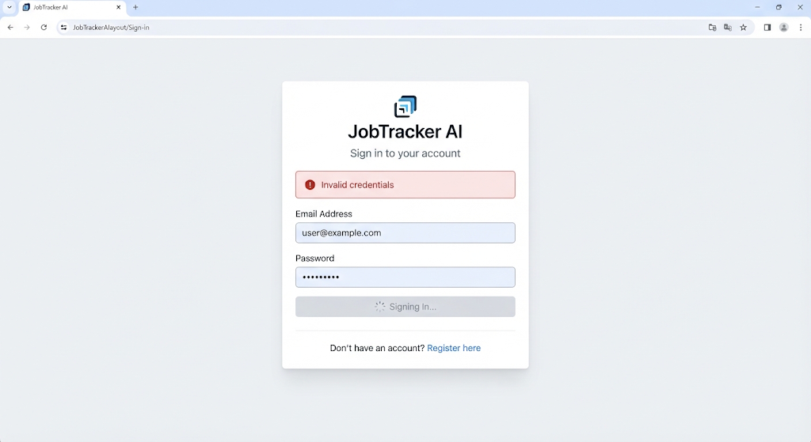
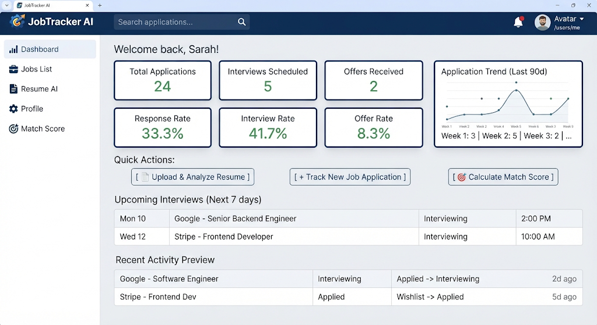
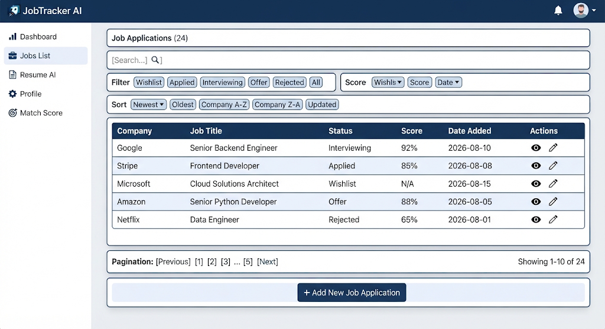
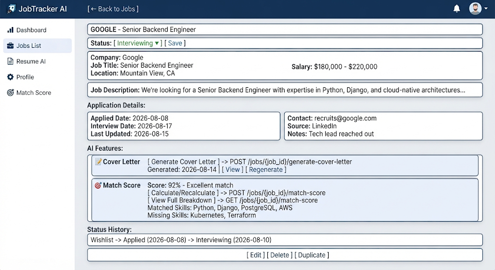
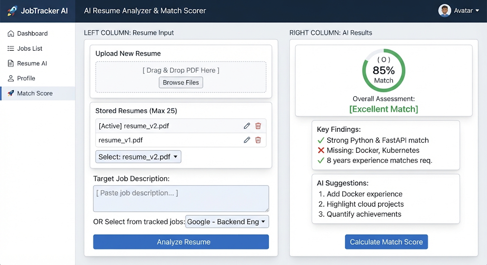
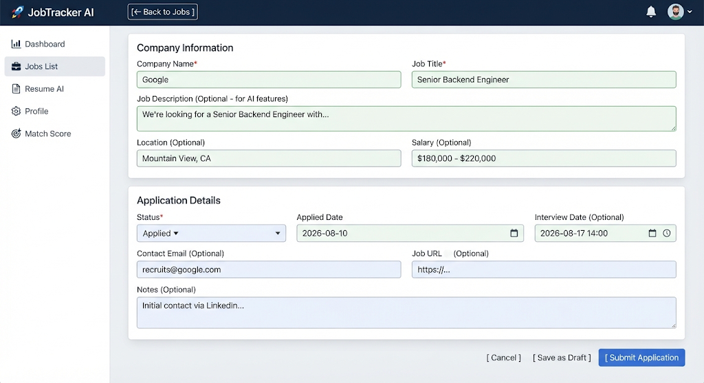
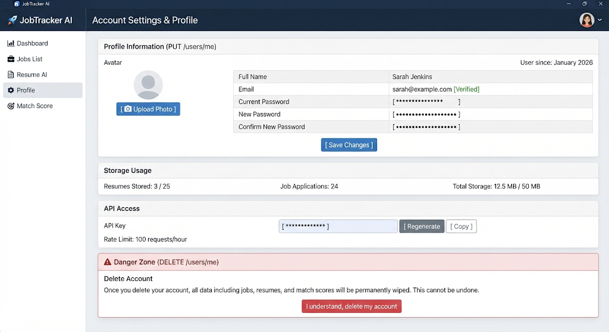
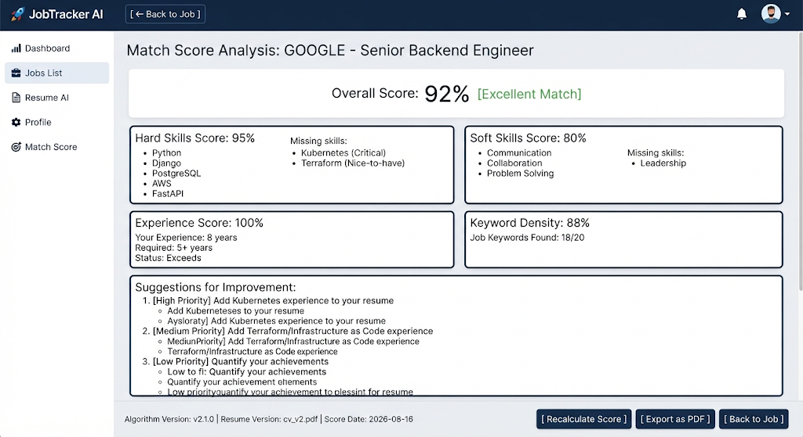
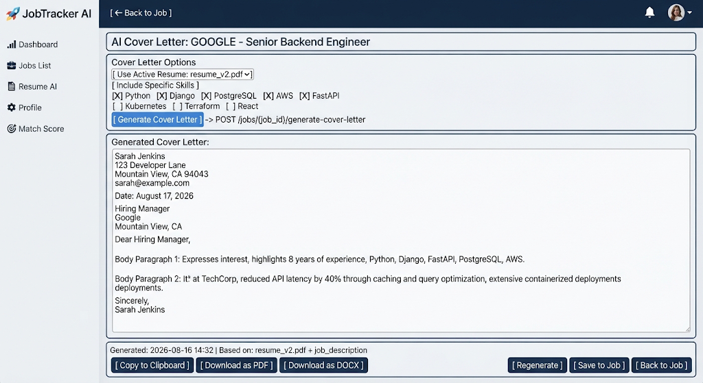

## Authentication View (/users/login & /users/register)

## Main Dashboard & Analytics Overview (/dashboard/stats)

## Jobs List View (GET /jobs/)

## Job Detail View (GET /jobs/{job_id})

## Resume Optimization View (POST /resumes/analyze, POST /resumes/{resume_id}/analyze)

## Job Application Create/Edit View (POST /jobs/, PUT /jobs/{job_id})

## User Profile View (GET /users/me, PUT /users/me, DELETE /users/me)

## Match Score Detail View (GET /jobs/{job_id}/match-score)

## Cover Letter Generation View (POST /jobs/{job_id}/generate-cover-letter)
